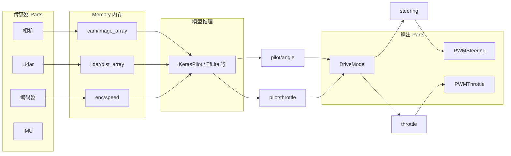

# Donkey Car 项目架构与 ROS 集成说明

## 一、重要说明：关于 ROS

**本项目（donkey_car_2026_2）目前不包含任何 ROS（Robot Operating System）原生支持。** 代码库中未发现 `rospy`、`rosbag` 或 ROS 相关依赖。

若需与 ROS 机器车集成，需要额外开发 ROS 桥接层（见下文第四节）。

---

## 二、项目结构详解

```
donkey_car_2026_2/
├── donkeycar/                 # 核心库
│   ├── vehicle.py             # Vehicle 主循环：按频率运行 Parts，通过 Memory 传递数据
│   ├── memory.py              # 键值存储，Parts 通过 inputs/outputs 读写
│   ├── config.py              # 配置加载
│   ├── utils.py               # 工具函数（含 get_model_by_type）
│   ├── pipeline/              # 训练流水线（数据加载、训练）
│   ├── templates/             # 驾驶应用模板
│   │   ├── complete.py        # 完整模板（推荐）：相机、模型、驱动链、Tub 等
│   │   ├── basic.py           # 简化模板
│   │   ├── path_follow.py     # 路径跟随（PID）
│   │   └── cv_control.py      # 计算机视觉控制
│   ├── management/            # 管理脚本（makemovie、tub_web、UI 等）
│   └── contrib/robohat/       # RoboHAT 相关（串口通信）
├── arduino/                   # 编码器固件
├── scripts/                   # 工具脚本（模型转换、远程相机等）
└── setup.cfg / pyproject.toml # 构建配置
```

**数据流架构（Vehicle 主循环）：**




---

## 三、模型输入/输出与当前数据获取方式

### 3.1 模型需要的数据（输入）


| 输入键                            | 数据类型                    | 来源           | 说明                                            |
| ------------------------------ | ----------------------- | ------------ | --------------------------------------------- |
| `cam/image_array`              | `numpy.ndarray` (H×W×3) | 相机 Part      | 默认 160×120×3 RGB，来自 PiCam/Webcam/CVCam/CSIC 等 |
| `lidar/dist_array`             | `numpy.ndarray`         | RPLidar Part | 可选，USE_LIDAR=True 时                           |
| `enc/speed`                    | `float`                 | 编码器/里程计 Part | 可选，HAVE_ODOM=True 时                           |
| `imu_array`                    | tuple (6 float)         | IMU Part     | 可选，model_type="imu" 时                         |
| `behavior/one_hot_state_array` | `numpy.ndarray`         | BehaviorPart | 可选，TRAIN_BEHAVIORS=True 时                     |


**当前数据获取方式（非 ROS）：**

- **相机**：通过 [donkeycar/templates/complete.py](donkeycar/templates/complete.py) 中 `add_camera()` 选择 `PiCamera`、`Webcam`、`CvCam`、`CSICamera` 等，直接调用设备 API
- **Lidar**：`RPLidar` Part 通过串口读取 RP 激光雷达
- **编码器**：Arduino 编码器固件 + 串口，或 Tachometer Part
- **IMU**：`IMU` Part 通过 I2C/串口读取

### 3.2 模型输出的数据


| 输出键              | 类型      | 含义                        |
| ---------------- | ------- | ------------------------- |
| `pilot/angle`    | `float` | 转向角，约 -1.0（左）～ +1.0（右）    |
| `pilot/throttle` | `float` | 油门，约 -1.0（倒车）～ +1.0（前进）   |
| `pilot/loc`      | int/str | 可选，TRAIN_LOCALIZER 时的位置分类 |


### 3.3 输出如何驱动机器车

1. **DriveMode** 根据 `user/mode` 选择用户控制或 AI 控制，输出 `steering`、`throttle`
2. **add_drivetrain()** 根据 `DRIVE_TRAIN_TYPE` 添加执行器：
  - **SERVO_ESC**：PCA9685 + PWMSteering + PWMThrottle（舵机 + ESC）
  - **PWM_STEERING_THROTTLE**：PulseController 控制 GPIO PWM
  - **DC_TWO_WHEEL**：差速驱动，左右轮独立 PWM
  - **RoboHAT**：串口发送 `steering, throttle` 到 RoboHAT 板
  - **Arduino**：ArduinoFirmata 协议
  - **VESC**：电调协议
3. **执行器接口**：`steering.run(angle)`、`throttle.run(throttle)`，内部转为 PWM 脉冲或串口命令

---

## 四、ROS 集成方案（需自行实现）

因项目本身无 ROS 支持，需新增「ROS 桥接 Parts」替代或补充现有传感器/执行器。

### 4.1 从 ROS 获取模型输入数据

创建 **ROS Subscriber Parts**，订阅 ROS 话题并写入 Memory：


| 模型输入               | 建议 ROS 话题/消息类型                            | Part 职责                                         |
| ------------------ | ----------------------------------------- | ----------------------------------------------- |
| `cam/image_array`  | `/camera/image_raw` (`sensor_msgs/Image`) | 订阅图像 → 解码为 numpy (H,W,3) → 写入 `cam/image_array` |
| `lidar/dist_array` | `/scan` (`sensor_msgs/LaserScan`)         | 订阅 → 按角度裁剪为数组 → 写入 `lidar/dist_array`           |
| `enc/speed`        | `/odom` (`nav_msgs/Odometry`) 或自定义        | 从 `twist.linear.x` 或编码器话题取速度 → 写入 `enc/speed`   |
| IMU                | `/imu` (`sensor_msgs/Imu`)                | 取加速度、角速度 → 写入 `imu/acl_x` 等                     |


实现要点：

- Part 需实现 `run_threaded()` 在后台线程中接收 ROS 消息，避免阻塞主循环
- 初始化时 `rospy.init_node()`，在主循环或独立线程中 `rospy.spin()`

### 4.2 将模型输出传到 ROS 机器车

创建 **ROS Publisher Part**，从 Memory 读取 `steering`、`throttle`，发布到 ROS：


| 输出                  | 建议 ROS 话题/消息类型                                                         | Part 职责                                       |
| ------------------- | ---------------------------------------------------------------------- | --------------------------------------------- |
| steering + throttle | `/cmd_vel` (`geometry_msgs/Twist`) 或 `/donkey/steering_throttle` (自定义) | 读取 `steering`、`throttle` → 转为线速度/角速度或原始值 → 发布 |


- 差速/阿克曼底盘：可将 `steering`、`throttle` 转为 `cmd_vel` 的 `linear.x`、`angular.z`
- 若底盘节点直接接受舵机/油门指令，可发布自定义消息（如 `std_msgs/Float32MultiArray`）

### 4.3 集成到模板

在 [donkeycar/templates/complete.py](donkeycar/templates/complete.py) 或新建 `ros_drive.py` 中：

1. 用 `ROSCameraSubscriber` 替代 `add_camera()`（或与本地相机二选一）
2. 用 `ROSLidarSubscriber` 替代 RPLidar（若用 ROS Lidar）
3. 用 `ROSCmdVelPublisher` 替代 `add_drivetrain()` 中的 PWM 执行器（或作为额外输出）

配置建议：`USE_ROS = True`，`ROS_CAMERA_TOPIC`、`ROS_CMD_VEL_TOPIC` 等。

### 4.4 依赖

在 `setup.cfg` 或 `pyproject.toml` 中增加：

```
ros = 
    rospkg
    # 若用 ROS1: 需在 ROS 环境中安装，使用 rospy
```

注意：ROS 通常需在已安装 ROS 的 Python 环境中运行，`rospy` 随 ROS 安装。

---

## 五、关键代码位置索引


| 功能              | 文件路径                                                                                             |
| --------------- | ------------------------------------------------------------------------------------------------ |
| 模型输入定义          | [donkeycar/templates/complete.py](donkeycar/templates/complete.py) 约 359-413 行                   |
| 模型输出与 DriveMode | [donkeycar/templates/complete.py](donkeycar/templates/complete.py) 396-454 行                     |
| 驱动链配置           | [donkeycar/templates/complete.py](donkeycar/templates/complete.py) 942-1136 行 `add_drivetrain()` |
| 主循环逻辑           | [donkeycar/vehicle.py](donkeycar/vehicle.py) `update_parts()`                                    |
| 内存读写            | [donkeycar/memory.py](donkeycar/memory.py)                                                       |
| 相机添加            | [donkeycar/templates/complete.py](donkeycar/templates/complete.py) `add_camera()` 约 833 行        |


---

## 六、小结

- **项目结构**：基于 Vehicle + Memory + Parts 的流水线架构，配置在 `templates/` 和 `config` 中
- **模型输入**：以 `cam/image_array` 为主，可选 lidar、编码器、IMU、行为向量
- **模型输出**：`pilot/angle`、`pilot/throttle`，经 DriveMode 后送往执行器
- **当前数据来源**：本地相机、串口设备、I2C 等，无 ROS
- **ROS 集成**：需新增 ROS Subscriber/Publisher Parts，订阅传感器话题、发布控制指令，并在模板中替换或补充现有 Parts

